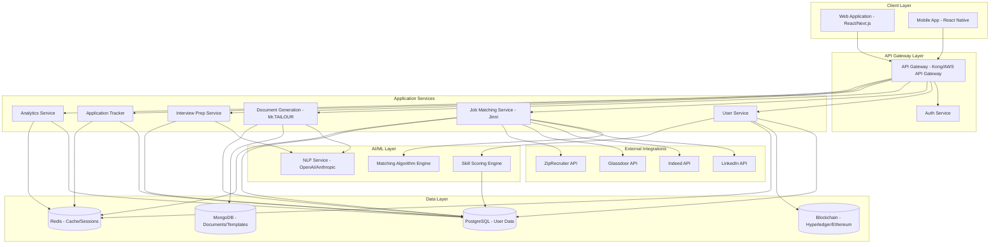
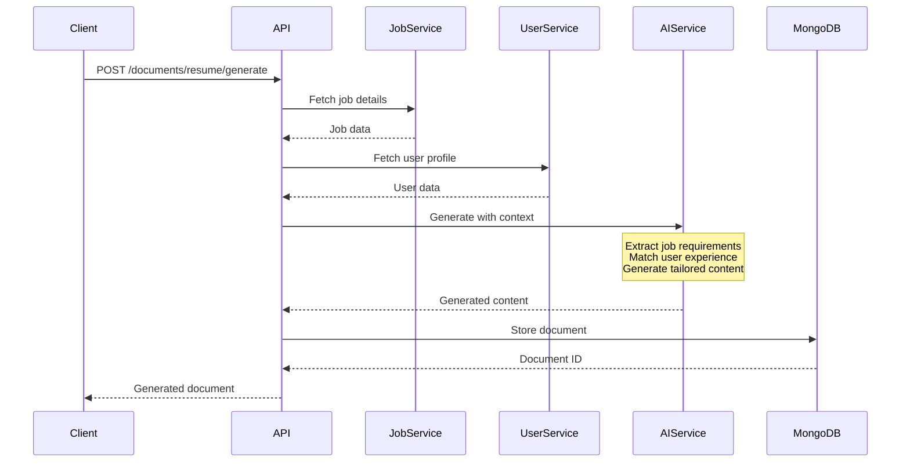
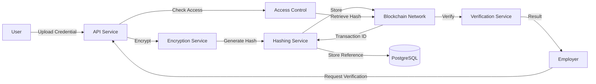
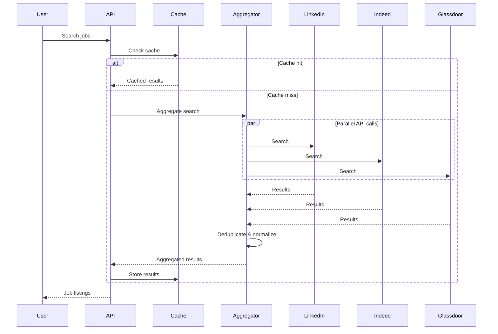
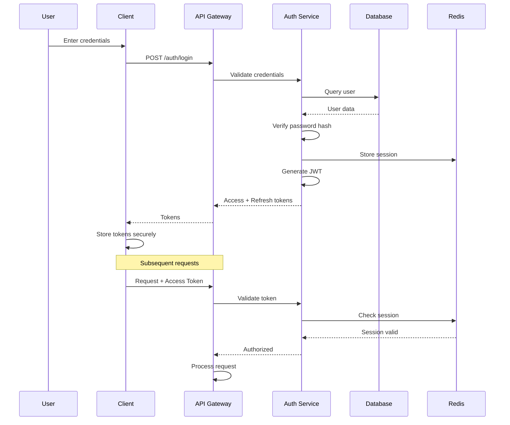
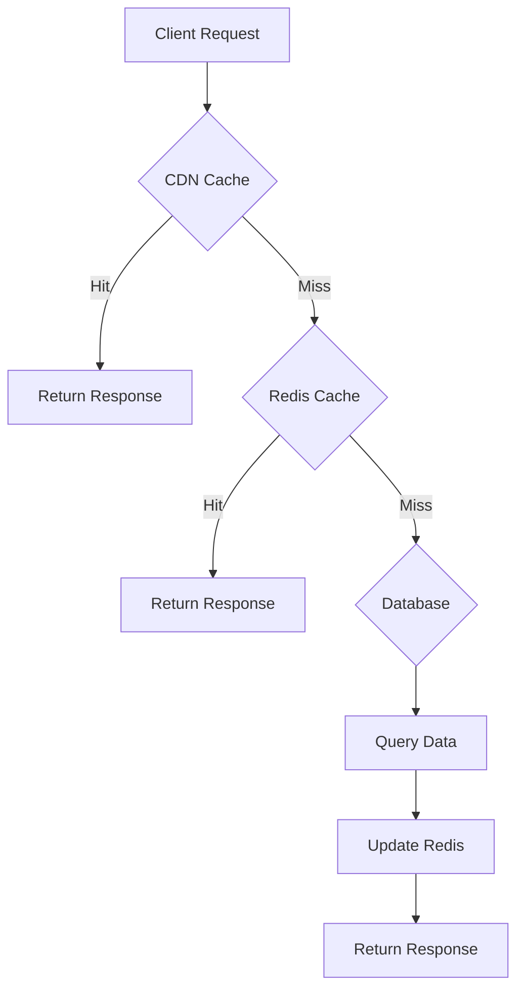
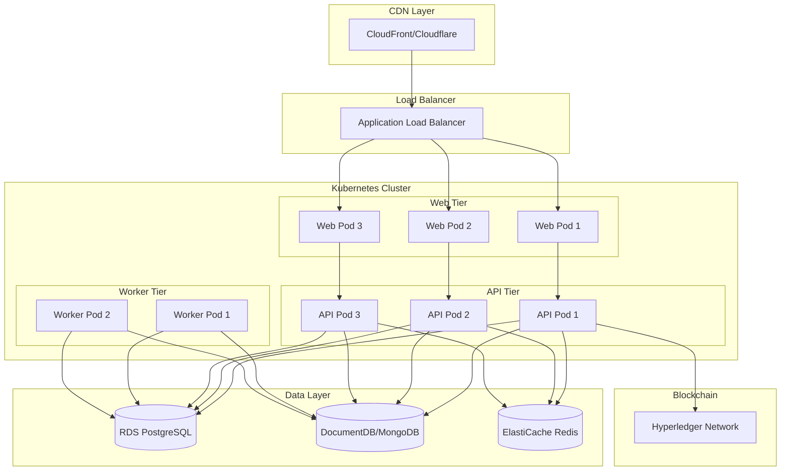

# Design Document - GiveMeJobs Platform

## Overview

GiveMeJobs is an AI-powered job application platform that streamlines the job search process through intelligent automation, personalized recommendations, and secure credential management. The platform combines traditional web technologies with blockchain for credential storage, AI/ML for content generation and matching, and integrates with major job boards to provide a comprehensive job search solution.

### Key Design Principles

- **Modularity**: Separate concerns into distinct services (authentication, job matching, document generation, blockchain)
- **Scalability**: Horizontal scaling capabilities for high traffic and concurrent AI operations
- **Security-First**: End-to-end encryption, blockchain immutability, and RBAC
- **Performance**: Sub-3-second response times for searches, sub-10-second AI generation
- **User-Centric**: Intuitive interfaces with progressive enhancement and accessibility

## Architecture

### High-Level Architecture



### Technology Stack

**Frontend:**
- Framework: Next.js 14 (React 18) with TypeScript
- State Management: Zustand or Redux Toolkit
- UI Components: Tailwind CSS + shadcn/ui
- Forms: React Hook Form + Zod validation
- Charts: Recharts or Chart.js
- Mobile: React Native (shared business logic)

**Backend:**
- Runtime: Node.js 20 LTS with TypeScript
- Framework: Express.js or Fastify
- API Gateway: Kong or AWS API Gateway
- Authentication: Passport.js + JWT
- Job Queue: Bull (Redis-based) for async tasks

**AI/ML:**
- LLM Provider: OpenAI GPT-4 or Anthropic Claude
- Vector Database: Pinecone or Weaviate (for semantic job matching)
- ML Framework: TensorFlow.js or Python microservice for skill scoring

**Databases:**
- Primary: PostgreSQL 15 (user profiles, applications, analytics)
- Document Store: MongoDB 7 (resume templates, generated documents)
- Cache: Redis 7 (sessions, job listings cache, rate limiting)
- Blockchain: Hyperledger Fabric or Ethereum (private network for credentials)

**Infrastructure:**
- Cloud Provider: AWS or Azure
- Container Orchestration: Kubernetes (EKS/AKS)
- CDN: CloudFront or Cloudflare
- Monitoring: Prometheus + Grafana, Sentry for error tracking
- Logging: ELK Stack (Elasticsearch, Logstash, Kibana)


## Components and Interfaces

### 1. Authentication Service

**Responsibilities:**
- User registration and login (email, OAuth)
- JWT token generation and validation
- Password hashing and recovery
- Session management
- Multi-factor authentication

**API Endpoints:**
```typescript
POST   /api/auth/register
POST   /api/auth/login
POST   /api/auth/logout
POST   /api/auth/refresh-token
POST   /api/auth/forgot-password
POST   /api/auth/reset-password
POST   /api/auth/oauth/linkedin
POST   /api/auth/oauth/google
POST   /api/auth/mfa/enable
POST   /api/auth/mfa/verify
```

**Key Interfaces:**
```typescript
interface User {
  id: string;
  email: string;
  passwordHash: string;
  firstName: string;
  lastName: string;
  professionalHeadline: string;
  createdAt: Date;
  updatedAt: Date;
  lastLogin: Date;
  mfaEnabled: boolean;
  oauthProviders: OAuthProvider[];
}

interface AuthToken {
  accessToken: string;
  refreshToken: string;
  expiresIn: number;
  tokenType: 'Bearer';
}

interface OAuthProvider {
  provider: 'linkedin' | 'google';
  providerId: string;
  accessToken: string;
  refreshToken?: string;
}
```

### 2. User Service

**Responsibilities:**
- Profile management (CRUD operations)
- Skill and experience tracking
- Career goal setting
- Blockchain credential integration
- Profile data synchronization

**API Endpoints:**
```typescript
GET    /api/users/:id
PUT    /api/users/:id
DELETE /api/users/:id
GET    /api/users/:id/profile
PUT    /api/users/:id/profile
POST   /api/users/:id/skills
PUT    /api/users/:id/skills/:skillId
DELETE /api/users/:id/skills/:skillId
POST   /api/users/:id/experience
PUT    /api/users/:id/experience/:expId
DELETE /api/users/:id/experience/:expId
POST   /api/users/:id/education
PUT    /api/users/:id/education/:eduId
DELETE /api/users/:id/education/:eduId
POST   /api/users/:id/credentials/upload
GET    /api/users/:id/credentials
POST   /api/users/:id/credentials/:credId/grant-access
POST   /api/users/:id/credentials/:credId/revoke-access
GET    /api/users/:id/skill-score
GET    /api/users/:id/skill-progress
```

**Key Interfaces:**
```typescript
interface UserProfile {
  userId: string;
  skills: Skill[];
  experience: Experience[];
  education: Education[];
  certifications: Certification[];
  portfolio: PortfolioItem[];
  careerGoals: CareerGoal[];
  preferences: UserPreferences;
  skillScore: number;
  blockchainAddress: string;
}

interface Skill {
  id: string;
  name: string;
  category: string;
  proficiencyLevel: 1 | 2 | 3 | 4 | 5;
  yearsOfExperience: number;
  endorsements: number;
  lastUsed: Date;
}

interface Experience {
  id: string;
  company: string;
  title: string;
  startDate: Date;
  endDate?: Date;
  current: boolean;
  description: string;
  achievements: string[];
  skills: string[];
}

interface Education {
  id: string;
  institution: string;
  degree: string;
  fieldOfStudy: string;
  startDate: Date;
  endDate?: Date;
  gpa?: number;
  credentialHash?: string; // Blockchain reference
}

interface CareerGoal {
  id: string;
  targetRole: string;
  targetCompanies: string[];
  targetSalary: number;
  timeframe: string;
  requiredSkills: string[];
  skillGaps: string[];
}

interface UserPreferences {
  jobTypes: ('full-time' | 'part-time' | 'contract' | 'internship')[];
  remotePreference: 'remote' | 'hybrid' | 'onsite' | 'any';
  locations: string[];
  salaryMin: number;
  salaryMax: number;
  industries: string[];
  companySizes: string[];
}
```


### 3. Job Matching Service (Jinni)

**Responsibilities:**
- Job search across multiple platforms
- AI-powered job matching and scoring
- Job recommendation engine
- Real-time job alerts
- Job data aggregation and deduplication

**API Endpoints:**
```typescript
GET    /api/jobs/search
GET    /api/jobs/:id
GET    /api/jobs/recommendations
POST   /api/jobs/:id/save
DELETE /api/jobs/:id/unsave
GET    /api/jobs/saved
POST   /api/jobs/alerts
GET    /api/jobs/alerts
PUT    /api/jobs/alerts/:id
DELETE /api/jobs/alerts/:id
GET    /api/jobs/:id/match-analysis
```

**Key Interfaces:**
```typescript
interface Job {
  id: string;
  externalId: string;
  source: 'linkedin' | 'indeed' | 'glassdoor' | 'ziprecruiter';
  title: string;
  company: string;
  location: string;
  remoteType: 'remote' | 'hybrid' | 'onsite';
  jobType: 'full-time' | 'part-time' | 'contract' | 'internship';
  salaryMin?: number;
  salaryMax?: number;
  description: string;
  requirements: string[];
  responsibilities: string[];
  benefits: string[];
  postedDate: Date;
  applicationDeadline?: Date;
  applyUrl: string;
  matchScore?: number; // Calculated per user
}

interface JobMatchAnalysis {
  jobId: string;
  userId: string;
  overallScore: number;
  breakdown: {
    skillMatch: number;
    experienceMatch: number;
    locationMatch: number;
    salaryMatch: number;
    cultureFit: number;
  };
  matchingSkills: string[];
  missingSkills: string[];
  recommendations: string[];
}

interface JobAlert {
  id: string;
  userId: string;
  name: string;
  criteria: {
    keywords: string[];
    locations: string[];
    jobTypes: string[];
    remoteTypes: string[];
    salaryMin?: number;
    minMatchScore?: number;
  };
  frequency: 'realtime' | 'daily' | 'weekly';
  active: boolean;
}

interface JobSearchQuery {
  keywords?: string;
  location?: string;
  remoteType?: string[];
  jobType?: string[];
  salaryMin?: number;
  salaryMax?: number;
  postedWithin?: number; // days
  page: number;
  limit: number;
}

interface JobSearchResult {
  jobs: Job[];
  total: number;
  page: number;
  totalPages: number;
}
```

**Matching Algorithm Design:**

The matching algorithm uses a weighted scoring system:

```typescript
interface MatchingWeights {
  skillMatch: 0.35;        // 35% - Most important
  experienceMatch: 0.25;   // 25% - Years and relevance
  locationMatch: 0.15;     // 15% - Geographic preference
  salaryMatch: 0.10;       // 10% - Compensation alignment
  cultureFit: 0.15;        // 15% - Company values, size, industry
}

// Skill matching uses semantic similarity via embeddings
// Experience matching considers years + role relevance
// Location uses distance calculation or remote preference
// Salary compares user expectations vs job offering
// Culture fit analyzes company data + user preferences
```


### 4. Document Generation Service (Mr.TAILOUR)

**Responsibilities:**
- AI-powered resume generation
- AI-powered cover letter generation
- Document template management
- Document versioning and storage
- Multi-format export (PDF, DOCX, TXT)

**API Endpoints:**
```typescript
POST   /api/documents/resume/generate
POST   /api/documents/cover-letter/generate
GET    /api/documents/:id
PUT    /api/documents/:id
DELETE /api/documents/:id
GET    /api/documents/user/:userId
POST   /api/documents/:id/export
GET    /api/documents/templates
POST   /api/documents/templates
PUT    /api/documents/templates/:id
```

**Key Interfaces:**
```typescript
interface DocumentGenerationRequest {
  userId: string;
  jobId: string;
  documentType: 'resume' | 'cover-letter';
  templateId?: string;
  customizations?: {
    tone?: 'professional' | 'casual' | 'enthusiastic';
    length?: 'concise' | 'standard' | 'detailed';
    focusAreas?: string[];
  };
}

interface GeneratedDocument {
  id: string;
  userId: string;
  jobId: string;
  documentType: 'resume' | 'cover-letter';
  title: string;
  content: DocumentContent;
  templateId: string;
  version: number;
  createdAt: Date;
  updatedAt: Date;
  metadata: {
    wordCount: number;
    keywordsUsed: string[];
    generationTime: number;
  };
}

interface DocumentContent {
  sections: DocumentSection[];
  formatting: FormattingOptions;
}

interface DocumentSection {
  type: 'header' | 'summary' | 'experience' | 'education' | 'skills' | 'custom';
  title: string;
  content: string | object;
  order: number;
}

interface ResumeTemplate {
  id: string;
  name: string;
  description: string;
  category: 'modern' | 'classic' | 'creative' | 'ats-friendly';
  sections: TemplateSectionConfig[];
  styling: TemplateStyles;
  isPublic: boolean;
}

interface CoverLetterTemplate {
  id: string;
  name: string;
  structure: {
    opening: string;
    body: string[];
    closing: string;
  };
  tone: string;
}
```

**AI Generation Pipeline:**




### 5. Application Tracker Service

**Responsibilities:**
- Application lifecycle management
- Status tracking and updates
- Follow-up reminders
- Application analytics
- Notes and feedback management

**API Endpoints:**
```typescript
POST   /api/applications
GET    /api/applications
GET    /api/applications/:id
PUT    /api/applications/:id
DELETE /api/applications/:id
PATCH  /api/applications/:id/status
POST   /api/applications/:id/notes
GET    /api/applications/:id/timeline
GET    /api/applications/stats
```

**Key Interfaces:**
```typescript
interface Application {
  id: string;
  userId: string;
  jobId: string;
  status: ApplicationStatus;
  appliedDate: Date;
  lastUpdated: Date;
  resumeId: string;
  coverLetterId?: string;
  applicationMethod: 'platform' | 'email' | 'company-website' | 'referral';
  notes: ApplicationNote[];
  timeline: ApplicationEvent[];
  followUpDate?: Date;
  interviewDate?: Date;
  offerDetails?: OfferDetails;
}

enum ApplicationStatus {
  SAVED = 'saved',
  APPLIED = 'applied',
  SCREENING = 'screening',
  INTERVIEW_SCHEDULED = 'interview_scheduled',
  INTERVIEW_COMPLETED = 'interview_completed',
  OFFER_RECEIVED = 'offer_received',
  ACCEPTED = 'accepted',
  REJECTED = 'rejected',
  WITHDRAWN = 'withdrawn'
}

interface ApplicationNote {
  id: string;
  content: string;
  createdAt: Date;
  type: 'general' | 'interview' | 'feedback' | 'follow-up';
}

interface ApplicationEvent {
  id: string;
  eventType: string;
  description: string;
  timestamp: Date;
  metadata?: Record<string, any>;
}

interface OfferDetails {
  salary: number;
  equity?: string;
  benefits: string[];
  startDate?: Date;
  deadline?: Date;
}

interface ApplicationStats {
  total: number;
  byStatus: Record<ApplicationStatus, number>;
  responseRate: number;
  averageResponseTime: number;
  interviewConversionRate: number;
  offerRate: number;
}

interface ApplicationHealthBar {
  currentStage: ApplicationStatus;
  stages: {
    name: string;
    status: 'completed' | 'current' | 'pending';
    date?: Date;
  }[];
  progressPercentage: number;
}
```


### 6. Interview Preparation Service

**Responsibilities:**
- Generate interview questions based on job requirements
- Provide suggested answers
- Record and analyze practice responses
- Schedule interview reminders
- Provide company research

**API Endpoints:**
```typescript
POST   /api/interview-prep/generate
GET    /api/interview-prep/:applicationId
POST   /api/interview-prep/:id/practice
POST   /api/interview-prep/:id/practice/:practiceId/analyze
GET    /api/interview-prep/:id/progress
POST   /api/interview-prep/:id/reminders
```

**Key Interfaces:**
```typescript
interface InterviewPrep {
  id: string;
  applicationId: string;
  userId: string;
  jobId: string;
  generatedAt: Date;
  interviewDate?: Date;
  questions: InterviewQuestion[];
  companyResearch: CompanyResearch;
  tips: string[];
}

interface InterviewQuestion {
  id: string;
  category: 'behavioral' | 'technical' | 'situational' | 'company-specific';
  question: string;
  suggestedAnswer: string;
  keyPoints: string[];
  starFramework?: {
    situation: string;
    task: string;
    action: string;
    result: string;
  };
  difficulty: 'easy' | 'medium' | 'hard';
}

interface PracticeSession {
  id: string;
  questionId: string;
  userId: string;
  recordingUrl?: string;
  transcript?: string;
  response: string;
  duration: number;
  createdAt: Date;
  analysis?: ResponseAnalysis;
}

interface ResponseAnalysis {
  overallScore: number;
  clarity: number;
  relevance: number;
  starMethodUsage: boolean;
  confidenceIndicators: string[];
  keywordsCovered: string[];
  suggestions: string[];
  strengths: string[];
  areasForImprovement: string[];
}

interface CompanyResearch {
  companyName: string;
  industry: string;
  size: string;
  culture: string[];
  recentNews: NewsItem[];
  values: string[];
  interviewProcess: string;
}

interface NewsItem {
  title: string;
  summary: string;
  url: string;
  publishedDate: Date;
}
```


### 7. Skill Scoring Engine

**Responsibilities:**
- Calculate user skill scores (0-100)
- Track skill progression over time
- Identify skill gaps
- Suggest learning resources
- Update scores based on new data

**Key Interfaces:**
```typescript
interface SkillScore {
  userId: string;
  overallScore: number;
  lastCalculated: Date;
  breakdown: {
    technicalSkills: number;
    experience: number;
    education: number;
    certifications: number;
    projectPortfolio: number;
    endorsements: number;
  };
  history: SkillScoreHistory[];
}

interface SkillScoreHistory {
  score: number;
  timestamp: Date;
  trigger: 'profile_update' | 'new_skill' | 'certification' | 'experience_added';
}

interface SkillGapAnalysis {
  userId: string;
  targetRole: string;
  currentSkills: Skill[];
  requiredSkills: RequiredSkill[];
  gaps: SkillGap[];
  recommendations: LearningResource[];
}

interface SkillGap {
  skillName: string;
  currentLevel: number;
  requiredLevel: number;
  priority: 'high' | 'medium' | 'low';
  estimatedLearningTime: string;
}

interface LearningResource {
  title: string;
  provider: string;
  type: 'course' | 'certification' | 'book' | 'tutorial';
  url: string;
  duration: string;
  cost: number;
  relevanceScore: number;
}
```

**Scoring Algorithm:**

```typescript
// Weighted scoring formula
const calculateSkillScore = (profile: UserProfile): number => {
  const weights = {
    technicalSkills: 0.30,
    experience: 0.25,
    education: 0.15,
    certifications: 0.15,
    projectPortfolio: 0.10,
    endorsements: 0.05
  };
  
  // Each component scored 0-100
  const scores = {
    technicalSkills: calculateTechnicalScore(profile.skills),
    experience: calculateExperienceScore(profile.experience),
    education: calculateEducationScore(profile.education),
    certifications: calculateCertificationScore(profile.certifications),
    projectPortfolio: calculatePortfolioScore(profile.portfolio),
    endorsements: calculateEndorsementScore(profile.skills)
  };
  
  return Object.entries(weights).reduce((total, [key, weight]) => {
    return total + (scores[key] * weight);
  }, 0);
};
```


### 8. Blockchain Service

**Responsibilities:**
- Store encrypted credential hashes
- Manage access tokens for credential verification
- Verify credential authenticity
- Handle key management
- Ensure GDPR compliance

**API Endpoints:**
```typescript
POST   /api/blockchain/credentials/store
GET    /api/blockchain/credentials/:id/verify
POST   /api/blockchain/credentials/:id/grant-access
POST   /api/blockchain/credentials/:id/revoke-access
GET    /api/blockchain/credentials/:id/access-log
```

**Key Interfaces:**
```typescript
interface BlockchainCredential {
  id: string;
  userId: string;
  credentialType: 'degree' | 'certification' | 'transcript' | 'license';
  credentialHash: string;
  encryptedData: string;
  blockchainTxId: string;
  timestamp: Date;
  issuer: string;
  expiryDate?: Date;
}

interface AccessGrant {
  id: string;
  credentialId: string;
  grantedTo: string; // Company/employer ID
  grantedBy: string; // User ID
  accessToken: string;
  expiresAt: Date;
  createdAt: Date;
  revoked: boolean;
  accessLog: AccessLogEntry[];
}

interface AccessLogEntry {
  timestamp: Date;
  action: 'granted' | 'accessed' | 'revoked';
  accessor: string;
  ipAddress: string;
}

interface CredentialVerification {
  credentialId: string;
  isValid: boolean;
  issuer: string;
  issuedDate: Date;
  verifiedAt: Date;
  blockchainProof: {
    txId: string;
    blockNumber: number;
    hashMatch: boolean;
  };
}
```

**Blockchain Architecture:**



**Privacy Design:**
- Only cryptographic hashes stored on blockchain
- Actual credential data encrypted and stored off-chain
- User controls access via time-limited tokens
- Immutable audit trail of access requests
- GDPR "right to be forgotten" via access revocation (data remains but inaccessible)


### 9. Analytics Service

**Responsibilities:**
- Track user job search metrics
- Generate performance insights
- Compare user metrics to platform averages
- Identify optimization opportunities
- Export reports

**API Endpoints:**
```typescript
GET    /api/analytics/dashboard
GET    /api/analytics/applications
GET    /api/analytics/skills
GET    /api/analytics/trends
GET    /api/analytics/benchmarks
POST   /api/analytics/export
```

**Key Interfaces:**
```typescript
interface AnalyticsDashboard {
  userId: string;
  period: 'week' | 'month' | 'quarter' | 'year';
  metrics: {
    applicationsSent: number;
    responseRate: number;
    interviewRate: number;
    offerRate: number;
    averageResponseTime: number;
    activeApplications: number;
  };
  trends: TrendData[];
  insights: Insight[];
  benchmarks: BenchmarkComparison;
}

interface TrendData {
  metric: string;
  data: {
    date: Date;
    value: number;
  }[];
  change: number; // Percentage change
  direction: 'up' | 'down' | 'stable';
}

interface Insight {
  type: 'success' | 'warning' | 'info';
  title: string;
  description: string;
  actionable: boolean;
  recommendation?: string;
}

interface BenchmarkComparison {
  userMetrics: Record<string, number>;
  platformAverage: Record<string, number>;
  percentile: number;
  comparison: {
    metric: string;
    userValue: number;
    avgValue: number;
    performance: 'above' | 'below' | 'average';
  }[];
}

interface ApplicationAnalytics {
  bestDaysToApply: string[];
  mostResponsiveCompanies: string[];
  highestConvertingResumeFormats: string[];
  averageTimeToResponse: Record<string, number>;
  successRateByIndustry: Record<string, number>;
}
```


### 10. External Integration Service

**Responsibilities:**
- Manage API connections to job boards
- Handle OAuth flows for LinkedIn
- Aggregate and normalize job data
- Implement rate limiting and retry logic
- Cache external data

**Key Interfaces:**
```typescript
interface ExternalJobProvider {
  name: 'linkedin' | 'indeed' | 'glassdoor' | 'ziprecruiter';
  apiKey: string;
  rateLimit: {
    requestsPerMinute: number;
    requestsPerDay: number;
  };
  endpoints: {
    search: string;
    jobDetails: string;
    apply?: string;
  };
}

interface JobAggregator {
  search(query: JobSearchQuery): Promise<Job[]>;
  deduplicate(jobs: Job[]): Job[];
  normalize(rawJob: any, source: string): Job;
}

interface LinkedInIntegration {
  authenticate(code: string): Promise<OAuthToken>;
  importProfile(accessToken: string): Promise<LinkedInProfile>;
  syncConnections(accessToken: string): Promise<Connection[]>;
  searchJobs(accessToken: string, query: JobSearchQuery): Promise<Job[]>;
}

interface LinkedInProfile {
  id: string;
  firstName: string;
  lastName: string;
  headline: string;
  summary: string;
  positions: LinkedInPosition[];
  education: LinkedInEducation[];
  skills: LinkedInSkill[];
}

interface RateLimiter {
  checkLimit(provider: string, userId: string): Promise<boolean>;
  incrementCounter(provider: string, userId: string): Promise<void>;
  getRemainingRequests(provider: string, userId: string): Promise<number>;
}
```

**Integration Flow:**




## Data Models

### PostgreSQL Schema

```sql
-- Users table
CREATE TABLE users (
  id UUID PRIMARY KEY DEFAULT gen_random_uuid(),
  email VARCHAR(255) UNIQUE NOT NULL,
  password_hash VARCHAR(255) NOT NULL,
  first_name VARCHAR(100) NOT NULL,
  last_name VARCHAR(100) NOT NULL,
  professional_headline VARCHAR(255),
  blockchain_address VARCHAR(255),
  mfa_enabled BOOLEAN DEFAULT FALSE,
  created_at TIMESTAMP DEFAULT CURRENT_TIMESTAMP,
  updated_at TIMESTAMP DEFAULT CURRENT_TIMESTAMP,
  last_login TIMESTAMP
);

-- User profiles
CREATE TABLE user_profiles (
  id UUID PRIMARY KEY DEFAULT gen_random_uuid(),
  user_id UUID REFERENCES users(id) ON DELETE CASCADE,
  skill_score DECIMAL(5,2) DEFAULT 0,
  preferences JSONB,
  created_at TIMESTAMP DEFAULT CURRENT_TIMESTAMP,
  updated_at TIMESTAMP DEFAULT CURRENT_TIMESTAMP
);

-- Skills
CREATE TABLE skills (
  id UUID PRIMARY KEY DEFAULT gen_random_uuid(),
  user_id UUID REFERENCES users(id) ON DELETE CASCADE,
  name VARCHAR(100) NOT NULL,
  category VARCHAR(50),
  proficiency_level INTEGER CHECK (proficiency_level BETWEEN 1 AND 5),
  years_of_experience DECIMAL(4,1),
  endorsements INTEGER DEFAULT 0,
  last_used DATE,
  created_at TIMESTAMP DEFAULT CURRENT_TIMESTAMP
);

-- Experience
CREATE TABLE experience (
  id UUID PRIMARY KEY DEFAULT gen_random_uuid(),
  user_id UUID REFERENCES users(id) ON DELETE CASCADE,
  company VARCHAR(255) NOT NULL,
  title VARCHAR(255) NOT NULL,
  start_date DATE NOT NULL,
  end_date DATE,
  current BOOLEAN DEFAULT FALSE,
  description TEXT,
  achievements TEXT[],
  skills TEXT[],
  created_at TIMESTAMP DEFAULT CURRENT_TIMESTAMP
);

-- Education
CREATE TABLE education (
  id UUID PRIMARY KEY DEFAULT gen_random_uuid(),
  user_id UUID REFERENCES users(id) ON DELETE CASCADE,
  institution VARCHAR(255) NOT NULL,
  degree VARCHAR(100) NOT NULL,
  field_of_study VARCHAR(100),
  start_date DATE NOT NULL,
  end_date DATE,
  gpa DECIMAL(3,2),
  credential_hash VARCHAR(255),
  created_at TIMESTAMP DEFAULT CURRENT_TIMESTAMP
);

-- Jobs (cached from external sources)
CREATE TABLE jobs (
  id UUID PRIMARY KEY DEFAULT gen_random_uuid(),
  external_id VARCHAR(255) NOT NULL,
  source VARCHAR(50) NOT NULL,
  title VARCHAR(255) NOT NULL,
  company VARCHAR(255) NOT NULL,
  location VARCHAR(255),
  remote_type VARCHAR(20),
  job_type VARCHAR(50),
  salary_min INTEGER,
  salary_max INTEGER,
  description TEXT,
  requirements TEXT[],
  responsibilities TEXT[],
  benefits TEXT[],
  posted_date TIMESTAMP,
  application_deadline TIMESTAMP,
  apply_url TEXT,
  created_at TIMESTAMP DEFAULT CURRENT_TIMESTAMP,
  updated_at TIMESTAMP DEFAULT CURRENT_TIMESTAMP,
  UNIQUE(external_id, source)
);

-- Applications
CREATE TABLE applications (
  id UUID PRIMARY KEY DEFAULT gen_random_uuid(),
  user_id UUID REFERENCES users(id) ON DELETE CASCADE,
  job_id UUID REFERENCES jobs(id),
  status VARCHAR(50) NOT NULL,
  applied_date TIMESTAMP DEFAULT CURRENT_TIMESTAMP,
  last_updated TIMESTAMP DEFAULT CURRENT_TIMESTAMP,
  resume_id UUID,
  cover_letter_id UUID,
  application_method VARCHAR(50),
  follow_up_date DATE,
  interview_date TIMESTAMP,
  offer_details JSONB,
  created_at TIMESTAMP DEFAULT CURRENT_TIMESTAMP
);

-- Application notes
CREATE TABLE application_notes (
  id UUID PRIMARY KEY DEFAULT gen_random_uuid(),
  application_id UUID REFERENCES applications(id) ON DELETE CASCADE,
  content TEXT NOT NULL,
  type VARCHAR(50),
  created_at TIMESTAMP DEFAULT CURRENT_TIMESTAMP
);

-- Application timeline
CREATE TABLE application_events (
  id UUID PRIMARY KEY DEFAULT gen_random_uuid(),
  application_id UUID REFERENCES applications(id) ON DELETE CASCADE,
  event_type VARCHAR(100) NOT NULL,
  description TEXT,
  metadata JSONB,
  timestamp TIMESTAMP DEFAULT CURRENT_TIMESTAMP
);

-- Skill score history
CREATE TABLE skill_score_history (
  id UUID PRIMARY KEY DEFAULT gen_random_uuid(),
  user_id UUID REFERENCES users(id) ON DELETE CASCADE,
  score DECIMAL(5,2) NOT NULL,
  breakdown JSONB,
  trigger VARCHAR(50),
  timestamp TIMESTAMP DEFAULT CURRENT_TIMESTAMP
);

-- Job alerts
CREATE TABLE job_alerts (
  id UUID PRIMARY KEY DEFAULT gen_random_uuid(),
  user_id UUID REFERENCES users(id) ON DELETE CASCADE,
  name VARCHAR(255) NOT NULL,
  criteria JSONB NOT NULL,
  frequency VARCHAR(20) NOT NULL,
  active BOOLEAN DEFAULT TRUE,
  created_at TIMESTAMP DEFAULT CURRENT_TIMESTAMP,
  updated_at TIMESTAMP DEFAULT CURRENT_TIMESTAMP
);

-- Blockchain credentials
CREATE TABLE blockchain_credentials (
  id UUID PRIMARY KEY DEFAULT gen_random_uuid(),
  user_id UUID REFERENCES users(id) ON DELETE CASCADE,
  credential_type VARCHAR(50) NOT NULL,
  credential_hash VARCHAR(255) NOT NULL,
  encrypted_data TEXT NOT NULL,
  blockchain_tx_id VARCHAR(255) NOT NULL,
  issuer VARCHAR(255),
  expiry_date DATE,
  created_at TIMESTAMP DEFAULT CURRENT_TIMESTAMP
);

-- Access grants
CREATE TABLE access_grants (
  id UUID PRIMARY KEY DEFAULT gen_random_uuid(),
  credential_id UUID REFERENCES blockchain_credentials(id) ON DELETE CASCADE,
  granted_to VARCHAR(255) NOT NULL,
  granted_by UUID REFERENCES users(id),
  access_token VARCHAR(255) UNIQUE NOT NULL,
  expires_at TIMESTAMP NOT NULL,
  revoked BOOLEAN DEFAULT FALSE,
  created_at TIMESTAMP DEFAULT CURRENT_TIMESTAMP
);

-- Access logs
CREATE TABLE access_logs (
  id UUID PRIMARY KEY DEFAULT gen_random_uuid(),
  grant_id UUID REFERENCES access_grants(id) ON DELETE CASCADE,
  action VARCHAR(50) NOT NULL,
  accessor VARCHAR(255),
  ip_address INET,
  timestamp TIMESTAMP DEFAULT CURRENT_TIMESTAMP
);

-- Indexes for performance
CREATE INDEX idx_users_email ON users(email);
CREATE INDEX idx_skills_user_id ON skills(user_id);
CREATE INDEX idx_experience_user_id ON experience(user_id);
CREATE INDEX idx_education_user_id ON education(user_id);
CREATE INDEX idx_jobs_source_external_id ON jobs(source, external_id);
CREATE INDEX idx_jobs_posted_date ON jobs(posted_date DESC);
CREATE INDEX idx_applications_user_id ON applications(user_id);
CREATE INDEX idx_applications_status ON applications(status);
CREATE INDEX idx_application_events_application_id ON application_events(application_id);
CREATE INDEX idx_skill_score_history_user_id ON skill_score_history(user_id);
CREATE INDEX idx_blockchain_credentials_user_id ON blockchain_credentials(user_id);
```


### MongoDB Collections

```javascript
// Resume templates collection
{
  _id: ObjectId,
  name: String,
  description: String,
  category: String, // 'modern', 'classic', 'creative', 'ats-friendly'
  sections: [
    {
      type: String,
      title: String,
      order: Number,
      required: Boolean,
      template: String
    }
  ],
  styling: {
    font: String,
    fontSize: Number,
    colors: Object,
    spacing: Object
  },
  isPublic: Boolean,
  createdBy: String, // User ID
  createdAt: Date,
  updatedAt: Date
}

// Generated documents collection
{
  _id: ObjectId,
  userId: String,
  jobId: String,
  documentType: String, // 'resume' or 'cover-letter'
  title: String,
  content: {
    sections: [
      {
        type: String,
        title: String,
        content: Mixed, // String or Object
        order: Number
      }
    ],
    formatting: Object
  },
  templateId: String,
  version: Number,
  metadata: {
    wordCount: Number,
    keywordsUsed: [String],
    generationTime: Number,
    aiModel: String
  },
  createdAt: Date,
  updatedAt: Date
}

// Cover letter templates collection
{
  _id: ObjectId,
  name: String,
  structure: {
    opening: String,
    body: [String],
    closing: String
  },
  tone: String,
  placeholders: [String],
  isPublic: Boolean,
  createdBy: String,
  createdAt: Date,
  updatedAt: Date
}

// Interview prep collection
{
  _id: ObjectId,
  applicationId: String,
  userId: String,
  jobId: String,
  questions: [
    {
      category: String,
      question: String,
      suggestedAnswer: String,
      keyPoints: [String],
      starFramework: Object,
      difficulty: String
    }
  ],
  companyResearch: {
    companyName: String,
    industry: String,
    size: String,
    culture: [String],
    recentNews: [Object],
    values: [String],
    interviewProcess: String
  },
  tips: [String],
  generatedAt: Date,
  interviewDate: Date
}

// Practice sessions collection
{
  _id: ObjectId,
  questionId: String,
  userId: String,
  recordingUrl: String,
  transcript: String,
  response: String,
  duration: Number,
  analysis: {
    overallScore: Number,
    clarity: Number,
    relevance: Number,
    starMethodUsage: Boolean,
    confidenceIndicators: [String],
    keywordsCovered: [String],
    suggestions: [String],
    strengths: [String],
    areasForImprovement: [String]
  },
  createdAt: Date
}
```


## Error Handling

### Error Response Format

All API errors follow a consistent format:

```typescript
interface ErrorResponse {
  error: {
    code: string;
    message: string;
    details?: any;
    timestamp: string;
    requestId: string;
  };
}
```

### Error Codes and HTTP Status Mapping

```typescript
enum ErrorCode {
  // Authentication errors (401)
  INVALID_CREDENTIALS = 'AUTH_001',
  TOKEN_EXPIRED = 'AUTH_002',
  TOKEN_INVALID = 'AUTH_003',
  MFA_REQUIRED = 'AUTH_004',
  
  // Authorization errors (403)
  INSUFFICIENT_PERMISSIONS = 'AUTHZ_001',
  RESOURCE_ACCESS_DENIED = 'AUTHZ_002',
  
  // Validation errors (400)
  INVALID_INPUT = 'VAL_001',
  MISSING_REQUIRED_FIELD = 'VAL_002',
  INVALID_FORMAT = 'VAL_003',
  
  // Resource errors (404)
  RESOURCE_NOT_FOUND = 'RES_001',
  USER_NOT_FOUND = 'RES_002',
  JOB_NOT_FOUND = 'RES_003',
  
  // Rate limiting (429)
  RATE_LIMIT_EXCEEDED = 'RATE_001',
  
  // External service errors (502, 503)
  EXTERNAL_SERVICE_ERROR = 'EXT_001',
  LINKEDIN_API_ERROR = 'EXT_002',
  JOB_BOARD_UNAVAILABLE = 'EXT_003',
  
  // AI service errors (500)
  AI_GENERATION_FAILED = 'AI_001',
  AI_TIMEOUT = 'AI_002',
  
  // Blockchain errors (500)
  BLOCKCHAIN_TRANSACTION_FAILED = 'BC_001',
  CREDENTIAL_VERIFICATION_FAILED = 'BC_002',
  
  // Server errors (500)
  INTERNAL_SERVER_ERROR = 'SRV_001',
  DATABASE_ERROR = 'SRV_002',
  CACHE_ERROR = 'SRV_003'
}
```

### Error Handling Strategy

**Client-Side:**
- Display user-friendly error messages
- Implement retry logic for transient failures
- Log errors to monitoring service (Sentry)
- Graceful degradation for non-critical features

**Server-Side:**
- Centralized error handling middleware
- Structured logging with context
- Automatic retry for external API calls with exponential backoff
- Circuit breaker pattern for external services
- Dead letter queue for failed async jobs

**Example Error Handler:**

```typescript
class ErrorHandler {
  static handle(error: Error, req: Request, res: Response) {
    const errorResponse: ErrorResponse = {
      error: {
        code: this.getErrorCode(error),
        message: this.getUserMessage(error),
        details: process.env.NODE_ENV === 'development' ? error.stack : undefined,
        timestamp: new Date().toISOString(),
        requestId: req.id
      }
    };
    
    // Log error
    logger.error('Request error', {
      error: error.message,
      stack: error.stack,
      requestId: req.id,
      userId: req.user?.id,
      path: req.path
    });
    
    // Send to monitoring
    Sentry.captureException(error, {
      user: { id: req.user?.id },
      tags: { requestId: req.id }
    });
    
    res.status(this.getStatusCode(error)).json(errorResponse);
  }
}
```

### Retry Strategy for External APIs

```typescript
interface RetryConfig {
  maxRetries: 3;
  initialDelay: 1000; // ms
  maxDelay: 10000; // ms
  backoffMultiplier: 2;
  retryableStatusCodes: [408, 429, 500, 502, 503, 504];
}

async function withRetry<T>(
  fn: () => Promise<T>,
  config: RetryConfig = defaultRetryConfig
): Promise<T> {
  let lastError: Error;
  
  for (let attempt = 0; attempt <= config.maxRetries; attempt++) {
    try {
      return await fn();
    } catch (error) {
      lastError = error;
      
      if (attempt === config.maxRetries) break;
      if (!isRetryable(error, config)) throw error;
      
      const delay = Math.min(
        config.initialDelay * Math.pow(config.backoffMultiplier, attempt),
        config.maxDelay
      );
      
      await sleep(delay);
    }
  }
  
  throw lastError;
}
```


## Testing Strategy

### Testing Pyramid

```
                    /\
                   /  \
                  / E2E \
                 /--------\
                /          \
               / Integration \
              /--------------\
             /                \
            /   Unit Tests     \
           /____________________\
```

### Unit Tests

**Coverage Target:** 80% minimum

**Tools:**
- Jest for JavaScript/TypeScript
- React Testing Library for frontend components
- Supertest for API endpoint testing

**Focus Areas:**
- Business logic functions
- Utility functions
- Data transformations
- Validation logic
- Scoring algorithms

**Example:**
```typescript
describe('SkillScoreCalculator', () => {
  it('should calculate correct skill score with all components', () => {
    const profile = createMockProfile();
    const score = calculateSkillScore(profile);
    expect(score).toBeGreaterThanOrEqual(0);
    expect(score).toBeLessThanOrEqual(100);
  });
  
  it('should weight technical skills at 30%', () => {
    const profile = createMockProfile({ technicalSkills: 100, others: 0 });
    const score = calculateSkillScore(profile);
    expect(score).toBe(30);
  });
});
```

### Integration Tests

**Coverage Target:** Key user flows and service interactions

**Tools:**
- Jest with test containers for databases
- Testcontainers for PostgreSQL, MongoDB, Redis
- Mock servers for external APIs (MSW)

**Focus Areas:**
- API endpoint integration
- Database operations
- Service-to-service communication
- External API integrations
- Authentication flows

**Example:**
```typescript
describe('Job Search Integration', () => {
  let app: Express;
  let db: PostgresContainer;
  
  beforeAll(async () => {
    db = await new PostgresContainer().start();
    app = createApp({ dbUrl: db.getConnectionString() });
  });
  
  it('should search jobs across multiple sources', async () => {
    const response = await request(app)
      .get('/api/jobs/search')
      .query({ keywords: 'software engineer', location: 'remote' })
      .set('Authorization', `Bearer ${testToken}`);
    
    expect(response.status).toBe(200);
    expect(response.body.jobs).toBeInstanceOf(Array);
    expect(response.body.jobs.length).toBeGreaterThan(0);
  });
});
```

### End-to-End Tests

**Coverage Target:** Critical user journeys

**Tools:**
- Playwright or Cypress
- Test data factories
- Visual regression testing (Percy or Chromatic)

**Critical Flows:**
1. User registration and profile setup
2. Job search and application
3. Resume generation and download
4. Application tracking
5. Interview preparation access

**Example:**
```typescript
test('complete job application flow', async ({ page }) => {
  // Login
  await page.goto('/login');
  await page.fill('[name="email"]', 'test@example.com');
  await page.fill('[name="password"]', 'password123');
  await page.click('button[type="submit"]');
  
  // Search for jobs
  await page.goto('/jobs/search');
  await page.fill('[name="keywords"]', 'software engineer');
  await page.click('button:has-text("Search")');
  
  // Apply to first job
  await page.click('.job-card:first-child');
  await page.click('button:has-text("Apply")');
  
  // Generate resume
  await page.click('button:has-text("Generate Resume")');
  await page.waitForSelector('.resume-preview');
  
  // Submit application
  await page.click('button:has-text("Submit Application")');
  await expect(page.locator('.success-message')).toBeVisible();
});
```

### Performance Tests

**Tools:**
- k6 or Artillery for load testing
- Lighthouse for frontend performance

**Targets:**
- API response time: < 2 seconds (95th percentile)
- AI generation: < 10 seconds
- Job search: < 3 seconds
- Page load time: < 3 seconds
- Time to Interactive: < 5 seconds

**Example Load Test:**
```javascript
import http from 'k6/http';
import { check, sleep } from 'k6';

export const options = {
  stages: [
    { duration: '2m', target: 100 }, // Ramp up
    { duration: '5m', target: 100 }, // Stay at 100 users
    { duration: '2m', target: 0 },   // Ramp down
  ],
  thresholds: {
    http_req_duration: ['p(95)<2000'], // 95% under 2s
  },
};

export default function () {
  const response = http.get('https://api.givemejobs.com/jobs/search?keywords=engineer');
  check(response, {
    'status is 200': (r) => r.status === 200,
    'response time < 2s': (r) => r.timings.duration < 2000,
  });
  sleep(1);
}
```

### Security Tests

**Tools:**
- OWASP ZAP for vulnerability scanning
- npm audit for dependency vulnerabilities
- Snyk for continuous security monitoring

**Focus Areas:**
- SQL injection prevention
- XSS prevention
- CSRF protection
- Authentication bypass attempts
- Authorization checks
- Rate limiting effectiveness
- Sensitive data exposure

### Test Data Management

**Strategy:**
- Factory pattern for test data creation
- Database seeding scripts
- Isolated test databases per test suite
- Cleanup after each test
- Anonymized production data for staging

**Example Factory:**
```typescript
class UserFactory {
  static create(overrides?: Partial<User>): User {
    return {
      id: faker.string.uuid(),
      email: faker.internet.email(),
      firstName: faker.person.firstName(),
      lastName: faker.person.lastName(),
      passwordHash: 'hashed_password',
      createdAt: new Date(),
      ...overrides
    };
  }
}
```


## Security Architecture

### Authentication Flow



### Authorization Model (RBAC)

**Roles:**
- `user`: Standard job seeker (default)
- `premium_user`: Paid subscription with additional features
- `admin`: Platform administrator
- `support`: Customer support staff

**Permissions:**
```typescript
const permissions = {
  user: [
    'profile:read',
    'profile:write',
    'jobs:search',
    'jobs:save',
    'applications:create',
    'applications:read',
    'applications:update',
    'documents:generate',
    'documents:read',
    'documents:update',
    'interview-prep:access',
    'analytics:read_own'
  ],
  premium_user: [
    ...permissions.user,
    'documents:unlimited',
    'interview-prep:advanced',
    'analytics:detailed',
    'priority_support'
  ],
  admin: [
    '*' // All permissions
  ],
  support: [
    'users:read',
    'applications:read',
    'support_tickets:manage'
  ]
};
```

### Data Encryption

**At Rest:**
- Database encryption: PostgreSQL TDE (Transparent Data Encryption)
- MongoDB encryption at rest
- Blockchain credentials: AES-256 encryption
- File storage: Server-side encryption (S3 SSE-KMS)

**In Transit:**
- TLS 1.3 for all API communications
- Certificate pinning for mobile apps
- HSTS headers enforced

**Sensitive Fields:**
```typescript
// Fields requiring encryption
const encryptedFields = [
  'users.password_hash',
  'blockchain_credentials.encrypted_data',
  'oauth_tokens.access_token',
  'oauth_tokens.refresh_token'
];

// Encryption service
class EncryptionService {
  private algorithm = 'aes-256-gcm';
  
  encrypt(data: string, key: Buffer): EncryptedData {
    const iv = crypto.randomBytes(16);
    const cipher = crypto.createCipheriv(this.algorithm, key, iv);
    
    let encrypted = cipher.update(data, 'utf8', 'hex');
    encrypted += cipher.final('hex');
    
    const authTag = cipher.getAuthTag();
    
    return {
      encrypted,
      iv: iv.toString('hex'),
      authTag: authTag.toString('hex')
    };
  }
  
  decrypt(encryptedData: EncryptedData, key: Buffer): string {
    const decipher = crypto.createDecipheriv(
      this.algorithm,
      key,
      Buffer.from(encryptedData.iv, 'hex')
    );
    
    decipher.setAuthTag(Buffer.from(encryptedData.authTag, 'hex'));
    
    let decrypted = decipher.update(encryptedData.encrypted, 'hex', 'utf8');
    decrypted += decipher.final('utf8');
    
    return decrypted;
  }
}
```

### Rate Limiting

**Strategy:**
- Token bucket algorithm
- Per-user and per-IP limits
- Different limits for different endpoints

**Configuration:**
```typescript
const rateLimits = {
  auth: {
    login: { requests: 5, window: '15m' },
    register: { requests: 3, window: '1h' }
  },
  api: {
    default: { requests: 100, window: '15m' },
    search: { requests: 50, window: '15m' },
    aiGeneration: { requests: 10, window: '1h' }
  },
  external: {
    linkedin: { requests: 100, window: '1h' },
    indeed: { requests: 1000, window: '1d' }
  }
};

// Implementation with Redis
class RateLimiter {
  async checkLimit(key: string, limit: number, window: string): Promise<boolean> {
    const current = await redis.incr(key);
    
    if (current === 1) {
      await redis.expire(key, this.parseWindow(window));
    }
    
    return current <= limit;
  }
}
```

### Input Validation and Sanitization

**Validation Library:** Zod

**Example Schemas:**
```typescript
const userRegistrationSchema = z.object({
  email: z.string().email().max(255),
  password: z.string()
    .min(8)
    .regex(/^(?=.*[a-z])(?=.*[A-Z])(?=.*\d)(?=.*[@$!%*?&])/,
      'Password must contain uppercase, lowercase, number, and special character'),
  firstName: z.string().min(1).max(100).trim(),
  lastName: z.string().min(1).max(100).trim(),
  professionalHeadline: z.string().max(255).trim().optional()
});

const jobSearchSchema = z.object({
  keywords: z.string().max(200).optional(),
  location: z.string().max(100).optional(),
  remoteType: z.array(z.enum(['remote', 'hybrid', 'onsite'])).optional(),
  jobType: z.array(z.enum(['full-time', 'part-time', 'contract', 'internship'])).optional(),
  salaryMin: z.number().int().positive().optional(),
  salaryMax: z.number().int().positive().optional(),
  page: z.number().int().positive().default(1),
  limit: z.number().int().positive().max(100).default(20)
});

// Sanitization
const sanitizeHtml = (input: string): string => {
  return DOMPurify.sanitize(input, {
    ALLOWED_TAGS: [],
    ALLOWED_ATTR: []
  });
};
```

### Security Headers

```typescript
app.use(helmet({
  contentSecurityPolicy: {
    directives: {
      defaultSrc: ["'self'"],
      styleSrc: ["'self'", "'unsafe-inline'"],
      scriptSrc: ["'self'"],
      imgSrc: ["'self'", 'data:', 'https:'],
      connectSrc: ["'self'", 'https://api.givemejobs.com'],
      fontSrc: ["'self'"],
      objectSrc: ["'none'"],
      mediaSrc: ["'self'"],
      frameSrc: ["'none'"]
    }
  },
  hsts: {
    maxAge: 31536000,
    includeSubDomains: true,
    preload: true
  },
  referrerPolicy: { policy: 'strict-origin-when-cross-origin' }
}));
```

### Audit Logging

**Events to Log:**
- Authentication attempts (success/failure)
- Authorization failures
- Profile changes
- Credential access grants/revocations
- Application submissions
- Document generations
- Admin actions

**Log Format:**
```typescript
interface AuditLog {
  timestamp: Date;
  eventType: string;
  userId?: string;
  ipAddress: string;
  userAgent: string;
  action: string;
  resource: string;
  resourceId?: string;
  result: 'success' | 'failure';
  metadata?: Record<string, any>;
}
```

### GDPR Compliance

**User Rights Implementation:**

1. **Right to Access:** Export all user data via API endpoint
2. **Right to Rectification:** Profile update endpoints
3. **Right to Erasure:** Account deletion with data anonymization
4. **Right to Data Portability:** JSON/CSV export functionality
5. **Right to Object:** Opt-out of analytics and marketing

**Data Retention:**
- Active user data: Indefinite
- Deleted account data: 30-day soft delete, then anonymized
- Application history: 2 years after last activity
- Audit logs: 7 years
- Blockchain credentials: Immutable but access revocable


## Performance Optimization

### Caching Strategy

**Multi-Layer Caching:**



**Cache Configuration:**

```typescript
const cacheConfig = {
  // Static assets
  static: {
    ttl: '1y',
    storage: 'CDN'
  },
  
  // Job listings
  jobs: {
    ttl: '15m',
    storage: 'Redis',
    invalidateOn: ['new_job_posted']
  },
  
  // User profiles
  profiles: {
    ttl: '1h',
    storage: 'Redis',
    invalidateOn: ['profile_updated']
  },
  
  // Job search results
  searchResults: {
    ttl: '5m',
    storage: 'Redis',
    keyPattern: 'search:{query}:{filters}'
  },
  
  // AI-generated content
  documents: {
    ttl: '24h',
    storage: 'Redis + MongoDB'
  },
  
  // Analytics data
  analytics: {
    ttl: '1h',
    storage: 'Redis',
    precompute: true
  }
};

// Cache implementation
class CacheService {
  async get<T>(key: string): Promise<T | null> {
    const cached = await redis.get(key);
    return cached ? JSON.parse(cached) : null;
  }
  
  async set(key: string, value: any, ttl: number): Promise<void> {
    await redis.setex(key, ttl, JSON.stringify(value));
  }
  
  async invalidate(pattern: string): Promise<void> {
    const keys = await redis.keys(pattern);
    if (keys.length > 0) {
      await redis.del(...keys);
    }
  }
}
```

### Database Optimization

**Query Optimization:**
- Proper indexing on frequently queried columns
- Composite indexes for multi-column queries
- Partial indexes for filtered queries
- Query result pagination
- Connection pooling

**Example Optimized Queries:**
```sql
-- Optimized job search with indexes
EXPLAIN ANALYZE
SELECT j.*, 
       COALESCE(js.match_score, 0) as match_score
FROM jobs j
LEFT JOIN job_scores js ON j.id = js.job_id AND js.user_id = $1
WHERE j.posted_date > NOW() - INTERVAL '30 days'
  AND j.location ILIKE $2
  AND j.job_type = ANY($3)
ORDER BY js.match_score DESC NULLS LAST, j.posted_date DESC
LIMIT 20 OFFSET $4;

-- Index to support this query
CREATE INDEX idx_jobs_search ON jobs(posted_date DESC, location, job_type)
WHERE posted_date > NOW() - INTERVAL '90 days';

CREATE INDEX idx_job_scores_user_job ON job_scores(user_id, job_id, match_score DESC);
```

**Connection Pooling:**
```typescript
const pool = new Pool({
  host: process.env.DB_HOST,
  port: 5432,
  database: process.env.DB_NAME,
  user: process.env.DB_USER,
  password: process.env.DB_PASSWORD,
  max: 20, // Maximum pool size
  min: 5,  // Minimum pool size
  idleTimeoutMillis: 30000,
  connectionTimeoutMillis: 2000,
});
```

### API Response Optimization

**Pagination:**
```typescript
interface PaginationParams {
  page: number;
  limit: number;
  sortBy?: string;
  sortOrder?: 'asc' | 'desc';
}

interface PaginatedResponse<T> {
  data: T[];
  pagination: {
    page: number;
    limit: number;
    total: number;
    totalPages: number;
    hasNext: boolean;
    hasPrev: boolean;
  };
}
```

**Field Selection:**
```typescript
// Allow clients to specify which fields they need
GET /api/users/123?fields=id,firstName,lastName,email

// Implementation
const selectFields = (data: any, fields?: string[]): any => {
  if (!fields || fields.length === 0) return data;
  
  return fields.reduce((acc, field) => {
    if (data[field] !== undefined) {
      acc[field] = data[field];
    }
    return acc;
  }, {});
};
```

**Response Compression:**
```typescript
import compression from 'compression';

app.use(compression({
  filter: (req, res) => {
    if (req.headers['x-no-compression']) {
      return false;
    }
    return compression.filter(req, res);
  },
  level: 6 // Compression level (0-9)
}));
```

### Async Processing

**Job Queue for Heavy Operations:**

```typescript
import Bull from 'bull';

// Define queues
const documentGenerationQueue = new Bull('document-generation', {
  redis: redisConfig
});

const emailQueue = new Bull('email', {
  redis: redisConfig
});

const jobAggregationQueue = new Bull('job-aggregation', {
  redis: redisConfig
});

// Process jobs
documentGenerationQueue.process(async (job) => {
  const { userId, jobId, documentType } = job.data;
  
  // Generate document using AI
  const document = await aiService.generateDocument({
    userId,
    jobId,
    documentType
  });
  
  // Store in MongoDB
  await documentService.save(document);
  
  // Notify user
  await emailQueue.add({
    to: job.data.userEmail,
    template: 'document-ready',
    data: { documentId: document.id }
  });
  
  return { documentId: document.id };
});

// Add job to queue
app.post('/api/documents/generate', async (req, res) => {
  const job = await documentGenerationQueue.add(req.body, {
    attempts: 3,
    backoff: {
      type: 'exponential',
      delay: 2000
    }
  });
  
  res.json({ jobId: job.id, status: 'processing' });
});
```

### Frontend Optimization

**Code Splitting:**
```typescript
// Lazy load routes
const JobSearch = lazy(() => import('./pages/JobSearch'));
const ApplicationTracker = lazy(() => import('./pages/ApplicationTracker'));
const InterviewPrep = lazy(() => import('./pages/InterviewPrep'));

// Route configuration
<Suspense fallback={<LoadingSpinner />}>
  <Routes>
    <Route path="/jobs" element={<JobSearch />} />
    <Route path="/applications" element={<ApplicationTracker />} />
    <Route path="/interview-prep" element={<InterviewPrep />} />
  </Routes>
</Suspense>
```

**Image Optimization:**
- Next.js Image component for automatic optimization
- WebP format with fallbacks
- Lazy loading for below-the-fold images
- Responsive images with srcset

**Bundle Optimization:**
- Tree shaking
- Minification
- Gzip/Brotli compression
- CDN for static assets

### Monitoring and Observability

**Metrics to Track:**
```typescript
const metrics = {
  // Performance
  'api.response_time': histogram,
  'api.request_rate': counter,
  'db.query_duration': histogram,
  'cache.hit_rate': gauge,
  
  // Business
  'users.registrations': counter,
  'applications.submitted': counter,
  'documents.generated': counter,
  'jobs.searched': counter,
  
  // Errors
  'errors.rate': counter,
  'errors.by_type': counter,
  
  // External services
  'external.linkedin.response_time': histogram,
  'external.openai.response_time': histogram,
  'external.api.errors': counter
};
```

**Health Check Endpoint:**
```typescript
app.get('/health', async (req, res) => {
  const health = {
    status: 'healthy',
    timestamp: new Date().toISOString(),
    uptime: process.uptime(),
    checks: {
      database: await checkDatabase(),
      redis: await checkRedis(),
      mongodb: await checkMongoDB(),
      blockchain: await checkBlockchain(),
      externalAPIs: await checkExternalAPIs()
    }
  };
  
  const isHealthy = Object.values(health.checks).every(check => check.status === 'up');
  
  res.status(isHealthy ? 200 : 503).json(health);
});
```


## Deployment Architecture

### Infrastructure Overview



### Container Configuration

**Dockerfile (API Service):**
```dockerfile
FROM node:20-alpine AS builder

WORKDIR /app

COPY package*.json ./
RUN npm ci --only=production

COPY . .
RUN npm run build

FROM node:20-alpine

WORKDIR /app

COPY --from=builder /app/dist ./dist
COPY --from=builder /app/node_modules ./node_modules
COPY --from=builder /app/package.json ./

RUN addgroup -g 1001 -S nodejs
RUN adduser -S nodejs -u 1001
USER nodejs

EXPOSE 3000

CMD ["node", "dist/index.js"]
```

**Kubernetes Deployment:**
```yaml
apiVersion: apps/v1
kind: Deployment
metadata:
  name: api-service
  namespace: givemejobs
spec:
  replicas: 3
  selector:
    matchLabels:
      app: api-service
  template:
    metadata:
      labels:
        app: api-service
    spec:
      containers:
      - name: api
        image: givemejobs/api:latest
        ports:
        - containerPort: 3000
        env:
        - name: NODE_ENV
          value: "production"
        - name: DB_HOST
          valueFrom:
            secretKeyRef:
              name: db-credentials
              key: host
        - name: DB_PASSWORD
          valueFrom:
            secretKeyRef:
              name: db-credentials
              key: password
        resources:
          requests:
            memory: "512Mi"
            cpu: "500m"
          limits:
            memory: "1Gi"
            cpu: "1000m"
        livenessProbe:
          httpGet:
            path: /health
            port: 3000
          initialDelaySeconds: 30
          periodSeconds: 10
        readinessProbe:
          httpGet:
            path: /ready
            port: 3000
          initialDelaySeconds: 5
          periodSeconds: 5
---
apiVersion: v1
kind: Service
metadata:
  name: api-service
  namespace: givemejobs
spec:
  selector:
    app: api-service
  ports:
  - protocol: TCP
    port: 80
    targetPort: 3000
  type: ClusterIP
---
apiVersion: autoscaling/v2
kind: HorizontalPodAutoscaler
metadata:
  name: api-service-hpa
  namespace: givemejobs
spec:
  scaleTargetRef:
    apiVersion: apps/v1
    kind: Deployment
    name: api-service
  minReplicas: 3
  maxReplicas: 10
  metrics:
  - type: Resource
    resource:
      name: cpu
      target:
        type: Utilization
        averageUtilization: 70
  - type: Resource
    resource:
      name: memory
      target:
        type: Utilization
        averageUtilization: 80
```

### CI/CD Pipeline

```yaml
# .github/workflows/deploy.yml
name: Deploy to Production

on:
  push:
    branches: [main]

jobs:
  test:
    runs-on: ubuntu-latest
    steps:
      - uses: actions/checkout@v3
      
      - name: Setup Node.js
        uses: actions/setup-node@v3
        with:
          node-version: '20'
          
      - name: Install dependencies
        run: npm ci
        
      - name: Run linter
        run: npm run lint
        
      - name: Run tests
        run: npm test
        
      - name: Run security audit
        run: npm audit --audit-level=high

  build:
    needs: test
    runs-on: ubuntu-latest
    steps:
      - uses: actions/checkout@v3
      
      - name: Configure AWS credentials
        uses: aws-actions/configure-aws-credentials@v2
        with:
          aws-access-key-id: ${{ secrets.AWS_ACCESS_KEY_ID }}
          aws-secret-access-key: ${{ secrets.AWS_SECRET_ACCESS_KEY }}
          aws-region: us-east-1
          
      - name: Login to Amazon ECR
        id: login-ecr
        uses: aws-actions/amazon-ecr-login@v1
        
      - name: Build and push Docker image
        env:
          ECR_REGISTRY: ${{ steps.login-ecr.outputs.registry }}
          ECR_REPOSITORY: givemejobs-api
          IMAGE_TAG: ${{ github.sha }}
        run: |
          docker build -t $ECR_REGISTRY/$ECR_REPOSITORY:$IMAGE_TAG .
          docker push $ECR_REGISTRY/$ECR_REPOSITORY:$IMAGE_TAG
          docker tag $ECR_REGISTRY/$ECR_REPOSITORY:$IMAGE_TAG $ECR_REGISTRY/$ECR_REPOSITORY:latest
          docker push $ECR_REGISTRY/$ECR_REPOSITORY:latest

  deploy:
    needs: build
    runs-on: ubuntu-latest
    steps:
      - uses: actions/checkout@v3
      
      - name: Configure kubectl
        uses: azure/k8s-set-context@v3
        with:
          method: kubeconfig
          kubeconfig: ${{ secrets.KUBE_CONFIG }}
          
      - name: Deploy to Kubernetes
        run: |
          kubectl set image deployment/api-service \
            api=${{ secrets.ECR_REGISTRY }}/givemejobs-api:${{ github.sha }} \
            -n givemejobs
          kubectl rollout status deployment/api-service -n givemejobs
          
      - name: Run smoke tests
        run: |
          npm run test:smoke
```

### Environment Configuration

**Development:**
- Local Docker Compose setup
- Hot reloading enabled
- Debug logging
- Mock external services

**Staging:**
- Kubernetes cluster (smaller instance sizes)
- Real external integrations
- Anonymized production data
- Performance testing

**Production:**
- Multi-AZ Kubernetes cluster
- Auto-scaling enabled
- Full monitoring and alerting
- Blue-green deployment strategy

### Disaster Recovery

**Backup Strategy:**
- PostgreSQL: Automated daily backups with 30-day retention
- MongoDB: Continuous backup with point-in-time recovery
- Redis: AOF persistence + RDB snapshots
- Blockchain: Distributed ledger (inherently backed up)

**Recovery Time Objectives:**
- RTO (Recovery Time Objective): 1 hour
- RPO (Recovery Point Objective): 15 minutes

**Failover Procedures:**
1. Database failover: Automatic promotion of read replica
2. Application failover: Kubernetes self-healing
3. Region failover: DNS-based traffic routing to backup region


## Design Decisions and Rationale

### 1. Microservices vs Monolith

**Decision:** Start with a modular monolith, evolve to microservices

**Rationale:**
- Faster initial development and deployment
- Easier debugging and testing in early stages
- Lower operational complexity
- Clear service boundaries allow future extraction
- Can split into microservices as scale demands

### 2. PostgreSQL for Primary Database

**Decision:** Use PostgreSQL as the primary relational database

**Rationale:**
- ACID compliance for critical user data
- Excellent JSON support (JSONB) for flexible schemas
- Strong indexing capabilities
- Mature ecosystem and tooling
- Cost-effective at scale
- Good performance for complex queries

### 3. MongoDB for Document Storage

**Decision:** Use MongoDB for resume templates and generated documents

**Rationale:**
- Flexible schema for varying document structures
- Native support for nested documents
- Easy versioning of templates
- Fast reads for document retrieval
- GridFS for large file storage

### 4. Redis for Caching and Sessions

**Decision:** Use Redis for caching, sessions, and job queues

**Rationale:**
- In-memory performance for sub-millisecond latency
- Built-in data structures (sets, sorted sets, hashes)
- Pub/sub for real-time features
- TTL support for automatic expiration
- Persistence options for durability

### 5. Blockchain for Credentials

**Decision:** Use Hyperledger Fabric for credential storage

**Rationale:**
- Private/permissioned network suitable for enterprise
- Better performance than public blockchains
- Lower transaction costs
- Modular architecture
- Strong privacy controls
- GDPR-friendly with off-chain data storage

**Alternative Considered:** Ethereum private network
- Rejected due to higher complexity and gas costs

### 6. OpenAI/Anthropic for AI Generation

**Decision:** Use GPT-4 or Claude for document generation and matching

**Rationale:**
- State-of-the-art language understanding
- Consistent quality output
- API-based, no infrastructure management
- Regular model improvements
- Good documentation and support

**Fallback Strategy:** Train custom models if costs become prohibitive at scale

### 7. Next.js for Frontend

**Decision:** Use Next.js with React for the web application

**Rationale:**
- Server-side rendering for SEO
- Built-in routing and API routes
- Excellent developer experience
- Strong TypeScript support
- Image optimization out of the box
- Large community and ecosystem

### 8. Kubernetes for Orchestration

**Decision:** Deploy on Kubernetes (EKS/AKS)

**Rationale:**
- Industry standard for container orchestration
- Excellent auto-scaling capabilities
- Self-healing and high availability
- Portable across cloud providers
- Rich ecosystem of tools
- Declarative configuration

### 9. JWT for Authentication

**Decision:** Use JWT tokens with refresh token rotation

**Rationale:**
- Stateless authentication
- Works well with microservices
- Can include custom claims
- Industry standard
- Good library support

**Security Measures:**
- Short-lived access tokens (15 minutes)
- Refresh token rotation
- Token revocation via Redis blacklist

### 10. Bull for Job Queues

**Decision:** Use Bull (Redis-based) for async job processing

**Rationale:**
- Built on Redis (already in stack)
- Reliable job processing with retries
- Priority queues support
- Good monitoring and UI
- Handles concurrency well

### 11. Semantic Search for Job Matching

**Decision:** Use vector embeddings for semantic job matching

**Rationale:**
- Better than keyword matching
- Understands context and synonyms
- Improves match quality
- Can use OpenAI embeddings or open-source alternatives

**Implementation:**
- Generate embeddings for job descriptions
- Generate embeddings for user profiles
- Use cosine similarity for matching
- Store in Pinecone or Weaviate for fast retrieval

### 12. Progressive Web App (PWA)

**Decision:** Implement PWA features for mobile web

**Rationale:**
- Single codebase for web and mobile web
- Offline capabilities
- Push notifications
- App-like experience
- No app store approval needed
- Easier updates

**Native Apps:** Consider React Native for iOS/Android if needed later

### 13. Multi-Tenancy Approach

**Decision:** Single database with tenant isolation via user_id

**Rationale:**
- Simpler architecture
- Lower operational overhead
- Easier to maintain
- Cost-effective
- Row-level security in PostgreSQL

### 14. API Versioning Strategy

**Decision:** URL-based versioning (e.g., /api/v1/users)

**Rationale:**
- Clear and explicit
- Easy to route and cache
- Simple for clients to understand
- Can run multiple versions simultaneously

### 15. Error Handling Philosophy

**Decision:** Fail fast with detailed error responses

**Rationale:**
- Easier debugging
- Better developer experience
- Clear error messages for users
- Structured error codes for programmatic handling

## Future Enhancements

### Phase 2 Features
- Video interview practice with AI feedback
- Salary negotiation assistant
- Career path visualization
- Networking recommendations
- Company culture matching algorithm
- Skills assessment tests
- Referral tracking system

### Technical Improvements
- GraphQL API alongside REST
- Real-time collaboration on documents
- Advanced analytics with ML predictions
- Mobile native apps (React Native)
- Voice interface for job search
- Browser extension for one-click applications
- Integration with more job boards (Monster, CareerBuilder, etc.)

### Scalability Enhancements
- Read replicas for database
- Separate microservices for AI operations
- Event-driven architecture with Kafka
- Multi-region deployment
- Edge computing for global performance

## Conclusion

This design document provides a comprehensive blueprint for building the GiveMeJobs platform. The architecture is designed to be scalable, secure, and maintainable while delivering a high-quality user experience. The technology choices balance modern best practices with practical considerations for a startup environment.

Key strengths of this design:
- **Scalable:** Can handle growth from hundreds to millions of users
- **Secure:** Multiple layers of security with encryption and blockchain
- **Performant:** Sub-3-second response times with caching and optimization
- **Maintainable:** Clear separation of concerns and modular architecture
- **Cost-effective:** Efficient use of resources with auto-scaling

The design allows for iterative development, starting with core features and expanding based on user feedback and business needs.
