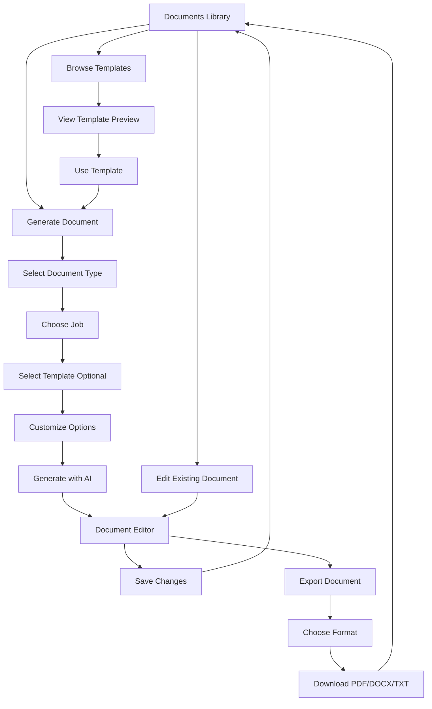

# Document Generation UI - User Flow

## Page Structure

```
/documents
├── /documents (Library - Main Page)
├── /documents/generate (Generation Page)
├── /documents/edit/[id] (Editor Page)
├── /documents/export/[id] (Export Page)
└── /documents/templates (Template Gallery)
```

## User Journey Flow



## Component Hierarchy

```
DocumentsPage (Library)
├── Search Bar
├── Filter Buttons (All, Resumes, Cover Letters)
├── Document Grid
│   └── Document Card
│       ├── Document Info
│       ├── Edit Button → Editor
│       ├── Export Button → Export Page
│       └── Delete Button → Confirmation Modal
└── Generate Button → Generation Page

GenerateDocumentPage
├── Document Type Selection
├── Job Selection Dropdown
├── Template Selection Dropdown
├── Customization Options
│   ├── Tone Selection
│   ├── Length Selection
│   └── Focus Areas Input
└── Generate Button → Editor

EditDocumentPage
├── Document Header
├── Editor Panel
│   └── Markdown-style Textarea
├── Preview Panel (Toggleable)
│   └── Formatted Preview
├── Document Metadata
└── Save Button

ExportDocumentPage
├── Document Info
├── Format Options
│   ├── PDF Export
│   ├── DOCX Export
│   └── TXT Export
└── Quick Actions

TemplatesPage
├── Category Filter
├── Template Grid
│   └── Template Card
│       ├── Preview Placeholder
│       ├── Template Info
│       ├── Preview Button → Modal
│       └── Use Template Button → Generation
└── Preview Modal
    ├── Full Template Preview
    └── Use Template Action
```

## State Management

```typescript
// Documents Store
useDocumentsStore {
  // State
  documents: GeneratedDocument[]
  templates: DocumentTemplate[]
  currentDocument: GeneratedDocument | null
  isLoading: boolean
  isGenerating: boolean
  
  // Actions
  generateResume(request)
  generateCoverLetter(request)
  getDocuments(userId)
  getDocumentById(id)
  updateDocument(id, content)
  deleteDocument(id)
  exportDocument(id, format)
  getTemplates()
  getTemplateById(id)
}
```

## API Endpoints Used

```
POST   /api/documents/resume/generate
POST   /api/documents/cover-letter/generate
GET    /api/documents/user/:userId
GET    /api/documents/:id
PUT    /api/documents/:id
DELETE /api/documents/:id
POST   /api/documents/:id/export
GET    /api/documents/templates
GET    /api/documents/templates/:id
```

## Key Features by Page

### Documents Library
- ✅ Search documents by title
- ✅ Filter by type (All, Resumes, Cover Letters)
- ✅ Grid layout with document cards
- ✅ Quick actions (Edit, Export, Delete)
- ✅ Delete confirmation modal
- ✅ Empty states
- ✅ Loading states

### Generate Document
- ✅ Document type selection (Resume/Cover Letter)
- ✅ Job selection from saved jobs
- ✅ Template selection (optional)
- ✅ Tone customization (professional, casual, enthusiastic)
- ✅ Length customization (concise, standard, detailed)
- ✅ Focus areas input
- ✅ AI generation with loading indicator
- ✅ Auto-redirect to editor

### Document Editor
- ✅ Markdown-style text editor
- ✅ Real-time preview panel
- ✅ Toggle preview visibility
- ✅ Save functionality
- ✅ Document metadata display
- ✅ Word count tracking
- ✅ Keywords display
- ✅ Version tracking

### Export Document
- ✅ PDF export
- ✅ DOCX export
- ✅ TXT export
- ✅ Format descriptions
- ✅ Download functionality
- ✅ Export tips
- ✅ Quick actions

### Templates Gallery
- ✅ Category filtering
- ✅ Template grid layout
- ✅ Template preview modal
- ✅ Sample content display
- ✅ Use template action
- ✅ Direct integration with generation

## Data Flow

```
User Action → Component → Store Action → API Call → Backend
                ↓                                      ↓
            UI Update ← Store Update ← Response ← Processing
```

### Example: Generate Resume

```
1. User fills generation form
2. Clicks "Generate Resume"
3. Component calls store.generateResume()
4. Store sets isGenerating = true
5. API POST /api/documents/resume/generate
6. Backend processes with AI
7. Response returns generated document
8. Store updates documents array
9. Store sets currentDocument
10. Store sets isGenerating = false
11. Component redirects to editor
12. Editor loads currentDocument
```

## Responsive Design

### Mobile (< 768px)
- Single column layout
- Stacked filters
- Full-width cards
- Collapsible preview in editor

### Tablet (768px - 1024px)
- 2-column grid
- Side-by-side filters
- Responsive cards

### Desktop (> 1024px)
- 3-column grid
- Full feature set
- Split-screen editor
- Optimal spacing

## Accessibility

- ✅ Semantic HTML
- ✅ ARIA labels
- ✅ Keyboard navigation
- ✅ Focus management
- ✅ Color contrast
- ✅ Screen reader support
- ✅ Loading indicators
- ✅ Error messages

## Performance Optimizations

- ✅ Lazy loading of documents
- ✅ Debounced search
- ✅ Optimistic UI updates
- ✅ Cached template data
- ✅ Efficient re-renders
- ✅ Code splitting by route
